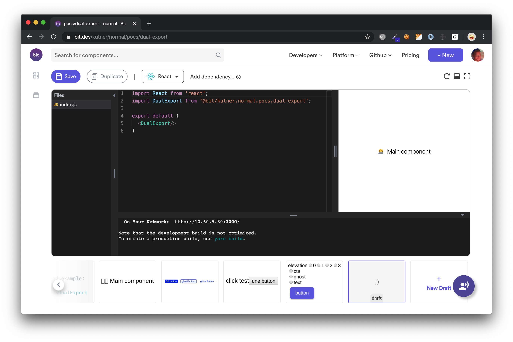

# Example Templates

This repository contains the boilerplates used by [bit.dev's playground](https://docs.bit.dev/docs/bit-dev#component-playground) for creating new examples. 




Templates are published [here](https://bit.dev/bit/javascript?namespaces=template)
Default generators are published [here](https://bit.dev/bit/javascript?namespaces=default-generator)

## Templates
Here is the list of existing templates:
* [react](./components/template/react/react-template.ts) (most of the code is [here](./components/default-generator/react/react/react-default-code.ts))
* [react-native](./components/template/react-native/index.ts)
* [angular](./components/template/angular/ng-template-generator.ts)
* [vue](./components/template/vue/vue-template.ts) (most of code is [here](./components/default-generator/vue/vue-default-code.ts))

### Template APIs
A template component should export the following interface  
(Currently, components use different names for exports, but they will be unified in the future)

```tsx
mainFile: string;
makeTemplate: ({ npmId: string }) => {
	files: { [filepath: string]: string };
	mainFile: string;
};
```

Example:
```tsx
export const mainFile = "index.js";
export const makeTemplate = ({npmId}) => (`
	import Component from ${npmId}
	
	export default () => Component();
`)
```

## Contributing

Contributions are welcome on this repository, and will be published to the collection and to bit.dev. 

1. Clone the repository
1. [Install bit](https://docs.bit.dev/docs/installation)
1. Run bit import to import all the components
1. Make code modifications
1. Run `bit build` or `yarn build`
1. Test the components: `bit test` or `yarn test`
1. Create a pull request with your changes

After approving the PR, the changes will be exported to the collection and deployed to bit.dev. 

Note: We are in a process of unifying all components to use the same tester. 
